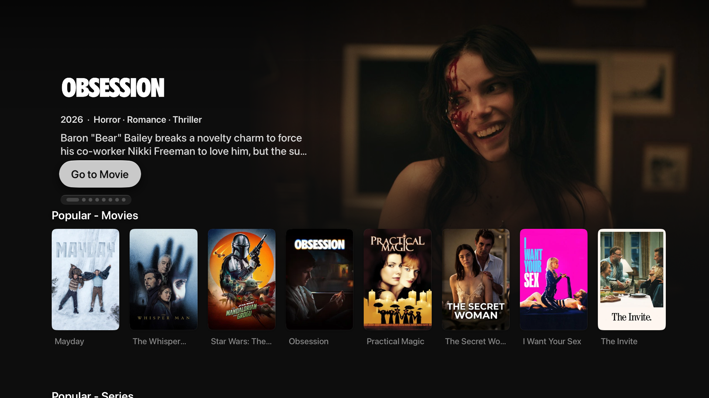
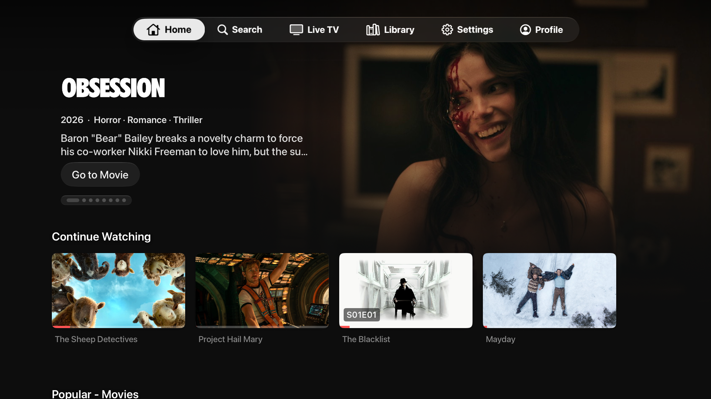

# Home navigation regression evidence

Captured September 13, 2026 on the Apple TV 4K 1080p simulator, tvOS 27 beta.
These screenshots show the real Home view in the dotjarden fork: before the fix
at commit ad5ec13 and after at 414601f. They are not presented as a test of the
unmodified upstream binary.

Reproduction: enter Home with its pinned hero, press Down three times, then Up
until the hero is focused. Before the fix, repeated Up leaves the native tab bar
at y=-445 while the shelves retain their previous offset. After the fix, returning
hero focus settles the shelves once and the native Home tab can receive focus.

The regression test also passes for five and eight Down presses, re-entering the
shelves, and switching to Search. The upstream proposal is limited to the single
onChange handler; independent upstream integration testing remains required.

| Before | After |
| --- | --- |
|  |  |
